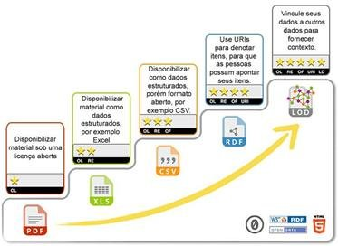

# Contexto Normativo

A Lei de Acesso à Informação foi o marco inicial da obrigação normativa de disponibilização de bases de dados públicos em formato aberto. Mais recentemente, o tema teve interesse renovado pela edição das Leis de Governo Aberto e o seu respectivo Decreto Estadual regulamentador.

## Lei de Acesso à Informação (LAI): Lei 12.527 de 2011

````
Art. 8º -  É dever dos órgãos e entidades públicas promover, independentemente de requerimentos, a divulgação (..) de informações de interesse coletivo ou geral por eles produzidas ou custodiadas. 
(...)
§ 3º  Os sítios [oficiais de governo] deverão atender aos requisitos (dentre outros):
    II - possibilitar a gravação de relatórios em diversos formatos eletrônicos, inclusive abertos e não proprietários, tais como planilhas e texto, de modo a facilitar a análise das informações;
    III - possibilitar o acesso automatizado por sistemas externos em formatos abertos, estruturados e legíveis por máquina;
    IV - divulgar em detalhes os formatos utilizados para estruturação da informação;
````

Formatos de arquivo não-proprietários não exigem uma licença para uso. Já os formatos proprietários não têm essa liberdade, como, por exemplo, os formatos word e excel.

Arquivos estruturados e legíveis por máquina têm formato padrão preestabelecido (p. ex. tabular) e passível de ser lido e interpretado (‘parseado’) por scripts,códigos ou programas, de forma automática. por exemplo, 'csv' e 'json' 

## Resolução CGE nº 20/2014

Esta norma infra da CGE replicou diretrizes para os dados abertos e pontuou as seguintes características dos dados abertos:

dados públicos (1) 

representados em meio digital (2), 

estruturados em formato aberto (3), 

processáveis por máquina (4), 

referenciados na rede mundial de computadores (5), 

disponibilizados sob licença aberta (6) 

que permita sua livre reutilização, consumo ou cruzamento em aplicações digitais desenvolvidas pela sociedade.

Acesse a Resolução [aqui](http://pesquisalegislativa.mg.gov.br/LegislacaoCompleta.aspx?cod=171158)


## Lei Federal 14.129 de 2011 - Lei do Governo Digital 

As recentes normas mostram o interesse renovado na regulamentação da transparência ativa. 

A Lei 14.129 criou a possibilidade de solicitação de abertura de base de dados, análoga à possibilidade de obtenção de informação via transparência passiva (e-SIC), com prazo predeterminado:
````
“Art. 30. Qualquer interessado poderá apresentar pedido de abertura de bases de dados da administração pública, que deverá conter os dados de contato do requerente e a especificação da base de dados requerida.
§ 1º O requerente poderá solicitar a preservação de sua identidade quando entender que sua identificação prejudicará o princípio da impessoalidade, caso em que o canal responsável deverá resguardar os dados sem repassá-los ao setor, ao órgão ou à entidade responsável pela resposta.
§ 2º Os procedimentos e os prazos previstos para o processamento de pedidos de acesso à informação, nos termos da Lei nº 12.527, de 18 de novembro de 2011 (Lei de Acesso à Informação), aplicam-se às solicitações de abertura de bases de dados da administração pública.”
````

Acesse a Lei 14129 [aqui](https://www.in.gov.br/en/web/dou/-/lei-n-14.129-de-29-de-marco-de-2021-311282132).


## Decreto Estadual 48.383

Tal dispositivo está referendando a aplicação da Lei Federal 14.129/2021 em Minas Gerais, além de instituir o Portal de Dados Abertos como o _lócus_ de publicação de dados de compartilhamento amplo:

````
Art. 27 – O compartilhamento amplo de dados dispensa autorização prévia pelo gestor de dados e será realizado pelos canais existentes para dados abertos e para transparência ativa, na forma da legislação.

§ 1º – Na hipótese de o dado de compartilhamento amplo de que trata o inciso I do art. 25 não estar disponível em formato aberto, o solicitante de dados poderá requerer sua abertura junto ao gestor de dados.

§ 2º – Na hipótese prevista no § 1º, o gestor de dados poderá condicionar a abertura de dados nos termos do art. 12 da Lei Federal nº 12.527, de 18 de novembro de 2011.

§ 3º – Os dados de compartilhamento amplo serão catalogados no Portal de Dados Abertos do Estado de Minas Gerais, https://www.dados.mg.gov.br, em formato aberto.
````

Acesse o decreto 48.383 [aqui](https://www.almg.gov.br/consulte/legislacao/completa/completa.html?tipo=DEC&num=48383&comp=&ano=2022)

# Princípios e Diretrizes

**[Leis dos Dados Abertos](https://eaves.ca/2009/09/30/three-law-of-open-government-data/) - por David Eaves:**

1. Se o dado não pode ser encontrado e indexado na web, ele não existe. 


    bases de dados de datawarehouses ou sistemas internos de acesso restrito não são abertos  
  
2. Se não estiver aberto e disponível em formato compreensível por máquina, ele não pode ser reaproveitado. 
 
    
    arquivos não-estruturados, como boletins (em pdf) não são compreendiddos por programas

3. Se algum dispositivo legal não permitir sua reaplicação, ele não é útil.


    dado disponível na web, em formato aberto e estruturado, mas tem uma licença restringindo seu uso

**Formatos**

Conforme a Cartilha Técnica para Publicação de Dados Abertos no Brasil, os principais formatos de dados abertos são os arquivos com as seguintes extensões:

	.csv, .xml, .ods, .rdf, .json


Os formatos `.PDF, .DOC, .DOCX, .XLS e .XLSX` são INCOMPATÍVEIS com a filosofia dos dados abertos!

**Escala de Dados Abertos**

★ : dados disponíveis na web (não importa o formato) sob uma licença aberta. Por exemplo, um PDF.

★ ★ : dados disponíveis de forma estruturada. Por exemplo, excel no lugar de imagem escaneada.

★ ★ ★ : dados disponíveis em formatos não-proprietários. Por exemplo, um CSV e não excel.

★ ★★ ★: identificador uniforme de recurso (exemplo?) RDF

★ ★★ ★★ : dados conectados (exemplo?) LOD



Nessa escala, o dado é considerado efetivamente aberto quando alcança o nível de três estrelas.

As demais estrelas fornecem mais possibilidades, como navegar mais facilmente por eles e encontrar novas informações e relações.


## Saiba Mais

Conheça mais um pouco sobre a importância dos dados abertos, suas diferenças e complementaridades com o Portal da Transparência no [17º episódio do PodeFalar!](https://www.youtube.com/watch?v=uFdYbIc_4ws), o nosso podcast da CGE, em que a então Subcontroladora de Transparência e Integridade, Nicolle Bleme, conversou com a Diretora-Executiva da Open Knowledge Brasil, Fernanda Campagnucci.

Clique [aqui](http://www.transparencia.mg.gov.br/) e conheça o Portal da Transparência do Estado de Minas Gerais.

