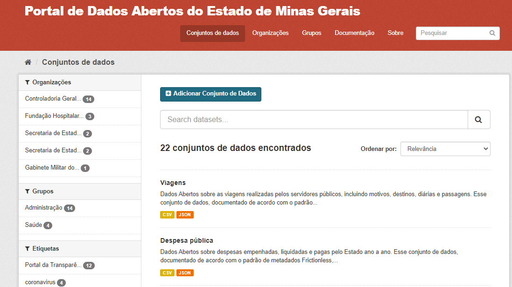

# Portal de Dados Abertos

Um Portal de Dados Abertos é uma ferramenta eletrônica capaz de reunir diferentes conjuntos de dados disponibilizados em formato aberto.

Reunir dados abertos em um único repositório facilita: 

 - pelos órgãos e entidades, a publicação dos conjuntos de dados

 - pela sociedade, a busca dos dados, pois não há necessidade de procura pelos diferentes sítios institucionais, ou solicitação direta aos órgaos e entidades.

Além disso, o Portal de Dados Abertos visa facilitar a análise das informações (Lei de Acesso à Informação, art. 8, parágrafo 3, inciso II), ao possibiltar:

* Extrair uma base de dados com diversos campos para selecionar apenas aqueles que mais interessam;

* Elaborar gráficos e tabelas mais informativas sobre determinada temática;

* Cruzar diferentes bases de dados que se complementam, para aprofundar o conhecimento sobre algo;

* Produzir reportagens e pesquisas científicas

* Desenvolver sites e aplicativos com as bases de dados fornecidas 

Dentre outros benefícios esperados com a publicação de conjuntos no Portal de Dados Abertos, estão:

* Padronização do formato de estruturação dos dados (uso de metadados com especificações de qualidade);

* Preparação para possíveis pedidos de abertura de dados (haja vista sua previsão legal a partir da regulamentação da Lei Federal 14.129, de 2021, pelo  Decreto Estadual 48.383, de 2022);

* Controle social, avaliações de usuários, parcerias.

O acesso ao Portal de Dados Abertos do Estado de Minas Gerais é realizado a partir do seguinte endereço eletrônico:

https://dados.mg.gov.br

O acesso pode ser feito pelo computador, telefone celular, ou qualquer outro dispositivo eletrônico que tenha navegador instalado e esteja conectado à internet.

