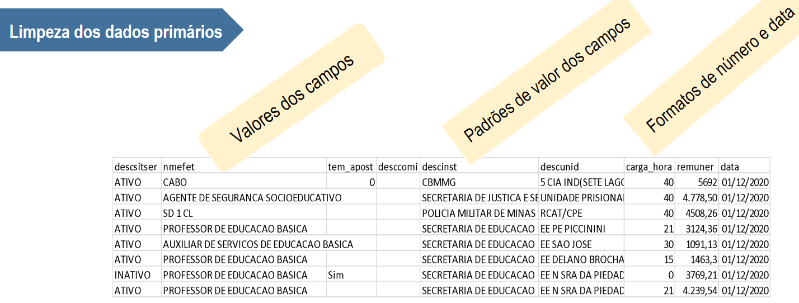

# Limpeza de Dados

Esta etapa tem o objetivo de oferecer informação íntegra aos usuários. A limpeza não se constitui, necessariamente, uma primeira etapa de uma sequência ordenada de ações. Ela usualmente é necessária após a documentação, ou validação dos dados, na medida em que forem identificadas incorreções, incompletudes ou inadequações com os metadados descritos. 

Exemplos: padronização do formato de valores de colunas (siglas, números, datas, unidades de medida); inclusão ou exclusão de colunas para padronização do layout dos arquivos.

Na figura a seguir, temos algumas inadequações na planilha de remuneração:

- Falta de padrão para valores:

    - na 2ª coluna: Valor abreviado 'SD 1 CL' e outros por extenso;

    - na 3ª coluna: zero ('0'), vazios ('') e 'sim';

    - na 5ª coluna: valor 'CBMMG' (nome do órgão abreviado) e outros nomes por extenso;

    - na 7ª coluna: separadores de milhar e de decimais para remuneração
    
- Formatos de número a serem descritos para valores de carga horária, na 6ª coluna; 

- Formato de descrição da data (última coluna): necessidade de descrição no datapackage.json (como %d%m%a)

A responsabilidade pela limpeza dos dados deve ser da área produtora (ou custodiante). Um guia sugestivo de problemas comuns, por responsável, pode ser encontrado [aqui](https://escoladedados.org/tutoriais/guia-quartz-para-limpeza-de-dados/)